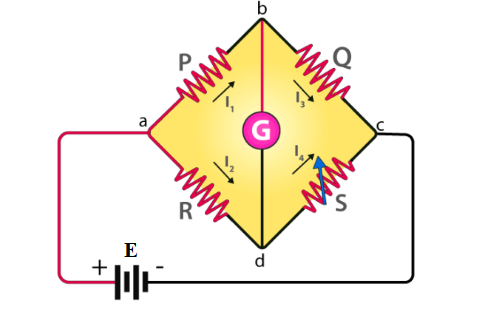

### Introduction

Wheatstone bridge also known as the resistance bridge, calculates the unknown resistance by balancing two legs of the bridge circuit. One leg includes the component of unknown resistance. Samuel Hunter Christie invented the Wheatstone bridge in 1833, which Sir Charles Wheatstone later popularised in 1843. 
The Wheatstone Bridge Circuit comprises two known resistors, one unknown resistor and one variable resistor connected in the form of a bridge. This bridge is very reliable as it gives accurate measurements. 

### Construction of Wheatstone Bridge
&nbsp;&nbsp;&nbsp;&nbsp;&nbsp;&nbsp;&nbsp;&nbsp;&nbsp;&nbsp;&nbsp;&nbsp;A Wheatstone bridge circuit consists of four arms of which two arms consist of known resistances while the other two arms consist of an unknown resistance and a variable resistance. The circuit also consists of a galvanometer and an electromotive force source. The emf source is attached between points a and c while the galvanometer is connected between the points b and d. The current that flows through the galvanometer depends on the potential difference across it. 

**Fig. 1 Wheatstone Bridge**

### Principle of Wheatstone Bridge
&nbsp;&nbsp;&nbsp;&nbsp;&nbsp;&nbsp;&nbsp;&nbsp;&nbsp;&nbsp;&nbsp;&nbsp;The Wheatstone bridge works on the principle of null deflection, i.e. the ratio of their resistances are equal and no current flows through the circuit. Under normal conditions, the bridge is in the unbalanced condition when current flows through the galvanometer. The bridge is said to be in a balanced condition when no current flows through the galvanometer. This condition can be achieved by adjusting the known resistance and variable resistance. 

### Wheatstone Bridge Derivation
The current enters the galvanometer and divides into two equal magnitude currents as I1 and I2. The following condition exists when the current through a galvanometer is zero,

$I_1P = I_2R......(1)$

The currents in the bridge, in a balanced condition, are expressed as follows:

$I_1 = I_3 = \frac{E}{P+Q}$ 

$I_2 = I_4 = \frac{E}{R+S}$  

Here, E is the emf of the battery.

By substituting the value of I1 and I2 in equation (1), we get

$\frac{PE}{P+Q} = \frac{RE}{R+S}$

$\frac{P}{P+Q} = \frac{R}{R+S}$

$P(R+S) = R(P+Q)$

$PR + PS = PR + QR$

$PS = QR.......(2)$

$R = \frac{P}{Q}*S......(3)$

Equation (2) shows the balanced condition of the bridge, while equation (3) determines the value of the unknown resistance. 

Where, R is the unknown resistance, S is the standard arm of the bridge and P & Q are the ratio arm of the bridge.

### Applications of Wheatstone Bridge: 
1. The Wheatstone bridge is used for the precise measurement of low resistance. 

2. Wheatstone bridge along with operational amplifier is used to measure physical parameters such as temperature, light and strain. 

3. Quantities such as Impedance, Inductance and Capacitance can be measured using variations on the Wheatstone bridge.

### Limitations of Wheatstone Bridge: 
1. For low resistance measurement, the resistance of the leads and contacts becomes significant and introduces an error.

2. For high resistance measurement, the measurement presented by the bridge is so large that the galvanometer is insensitive to imbalance. 

3. The other drawback is the change in the resistance due to the heating effect of the current through the resistance. Excessive current may even cause a permanent change in the value of resistance.

