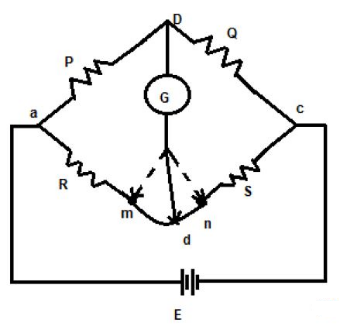

### Introduction
&nbsp;&nbsp;&nbsp;&nbsp;&nbsp;&nbsp;&nbsp;&nbsp;&nbsp;&nbsp;&nbsp;&nbsp;A kelvin bridge or kelvin double bridge is a modified version of the Wheatstone bridge, which can measure resistance values in the range between 1 to 0.00001 ohms with high accuracy. It is named because it uses another set of ratio arms and a galvanometer to measure the unknown resistance value. The basic operation of the Kelvin double bridge can be understood from the basic construction and operation of the kelvin bridge.  

### Principle of Kelvin Bridge 
&nbsp;&nbsp;&nbsp;&nbsp;&nbsp;&nbsp;&nbsp;&nbsp;&nbsp;&nbsp;&nbsp;&nbsp;A kelvin bridge or kelvin double bridge is a modified version of the Wheatstone bridge, which can measure resistance values in the range between 1 to 0.00001 ohms with high accuracy. It is named because it uses another set of ratio arms and a galvanometer to measure the unknown resistance value. The basic operation of the Kelvin double bridge can be understood from the basic construction and operation of the kelvin bridge.  

### Derivation for Finding Unknown Resistance Value
&nbsp;&nbsp;&nbsp;&nbsp;&nbsp;&nbsp;&nbsp;&nbsp;&nbsp;&nbsp;&nbsp;&nbsp;The Kelvin bridge is of resistance “r” which connects “R” ( unknown resistor ) to standard resistor “S”. The resistance value can be viewed in the galvanometer (from “m to n”). If the pointer in the galvanometer shows at “m”. It means, the resistance value is less and if the pointer shows at “n” means the resistance value is high. Hence rather by connecting galvanometer to “ m and n “ we choose another intermediate point “d” in kelvin bridge as shown in figure 

**Fig. 1 Kelvin bridge**

#### The value of resistance can be calculated as follows:  
r1 / r2 = P/Q …………(1)  
R + r1 = (P/Q) * (S+r2)  
#### Where from 1  
r1 / ( r1+ r2) = P / (P+Q)  
r1 = [P / (P+Q) ].r  
#### we know that  
r1+r2 =r  
r2 = [Q / (P+Q)] .r  
R +[ P/( P + Q)] * r = P/Q [ S+ (Q/(P+Q)*r)]  
R = (P/Q)*S ………….(2)  
&nbsp;&nbsp;&nbsp;&nbsp;&nbsp;&nbsp;&nbsp;&nbsp;&nbsp;From the above equation, we can say that by connecting the galvanometer at point “d” there will be no effect in the measurement of the actual resistance value, but the only disadvantage of this process is that it is difficult to implement, hence we use a Kelvin double bridge for getting accurate low resistance value.

### Circuit Diagram of Kelvin Double Bridge
&nbsp;&nbsp;&nbsp;&nbsp;&nbsp;&nbsp;&nbsp;&nbsp;&nbsp;&nbsp;&nbsp;&nbsp;The construction of Kelvin double bridge is similar to the wheat stone bridge, but the only difference is it consists of 2 arms “P & Q”, “p & q” where the arm “p & q” is connected to one end of the galvanometer, at “d” and “P & Q” is connected to another end of the galvanometer, at ‘b’. This connection minimizes the effect of connecting lead and the unknown resistor R & a standard resistor S is placed between ” m and n”, and “a and c”.
 

 

 

**Fig. 2 Kelvin double bridge circuit**

### Derivation 
#### The ratio p/q = P/Q,  
#### Under the balanced condition current in galvanometer = 0  
#### Potential difference at a & b = voltage drop between Eamd.  
Eab = [P / P+Q ] Eac  
Eac = I [ R + S + [( p+q)r] / [p+q+r]] …………(3)  
Eamd = I [ R + (p / (p+q)) * {(p+q) r / (p+q+r)}]  
Eac = I [ p r / ( p+q+r)] ………(4)  
#### When galvanometer shows zero then  
(P / P+Q) * I [ R + (p / (p+q)) * {(p+q) r / (p+q+r)} ] = I [ p r / (p+q+r)]  
R = (P /R)* S + p r / (p+q+r) [ (P/Q) – (p/q)]  
#### We know that  
P/Q = p/q  
R = (P/Q) * S …….(5)  
&nbsp;&nbsp;&nbsp;&nbsp;&nbsp;&nbsp;&nbsp;&nbsp;&nbsp;For obtaining perfect results, the arms ratio should be maintained equal and the thermo-electric electromagnetic field induced in the bridge while taking readings can be reduced by interchanging the polarity of the connection. Therefore the unknown resistance value can be obtained from the two arms. Typically, it measures 1 – 0.00001 ohm with an accuracy ± 0.05% to ±0.2%, in order to achieve sensitivity the current to be supplied should be large.

### Advantages

* It can measure the resistance value in the range of 0.1 µA to 1.0 A.
* Power consumption is less.
* Simple in construction.
* Sensitivity is high

### Disadvantages of Two Wattmeter
* For knowing whether the bridge is balanced or no, the sensitive galvanometer is used.
* To obtain good sensitivity of the device, a high current is required.
* Manual adjustments are to made periodically when required. 

### Applications of Two Wattmeter
* It is used to measure the unknown resistance of a wire.